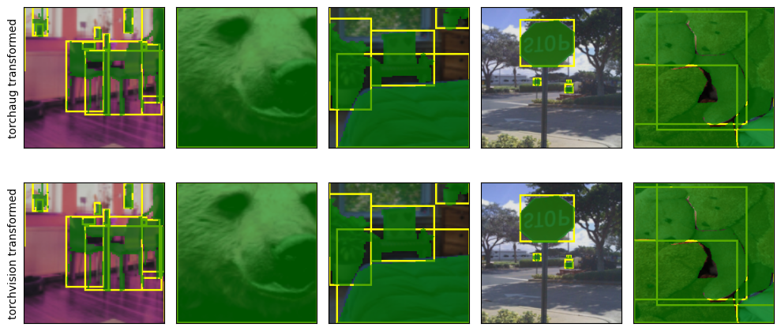
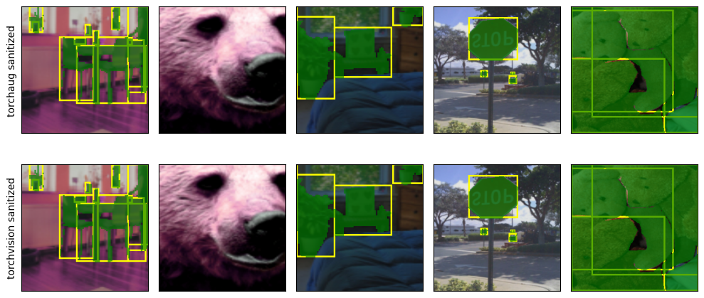

# COCO dataset example: batch transforms

## Introduction

In this example, we will show you how to perform transformations for object detection using **Torchaug** through **batch tensors** that stacks images, boxes and masks. This can only be used when images are of the same shape which requires former resizing.

We also make qualitative comparison with Torchvision that cannot handle batch transforms or nested tensors natively. However, **Torchaug follows Torchvision's implementations** which lets you chose the transform library of your choice.

## Set Up

### Imports

Here we import all the required modules for the notebook.

```python
import pathlib
import random

import matplotlib.pyplot as plt
import numpy as np
import torch
import torchvision.transforms.v2.functional as TVF
from torch.utils.data import DataLoader
from torchvision import datasets, tv_tensors
from torchvision.transforms import v2 as tv_transforms
from torchvision.tv_tensors._dataset_wrapper import wrap_dataset_for_transforms_v2 as tv_wrap_dataset_for_transforms_v2
from torchvision.utils import draw_bounding_boxes, draw_segmentation_masks

from torchaug import ta_tensors
from torchaug import transforms as ta_transforms
from torchaug.data.dataloader import default_collate
from torchaug.data.dataset import wrap_dataset_for_transforms_v2
```

### Utils functions

Here we define utilities functions for plotting and handling various data structure.

```python
#### visualization function tools
def plot(imgs, row_title=None, **imshow_kwargs):
    if not isinstance(imgs[0], list):
        # Make a 2d grid even if there's just 1 row
        imgs = [imgs]

    num_rows = len(imgs)
    num_cols = len(imgs[0])
    _, axs = plt.subplots(nrows=num_rows, ncols=num_cols, figsize=(10, 5), squeeze=False)
    for row_idx, row in enumerate(imgs):
        for col_idx, img in enumerate(row):
            boxes = None
            masks = None
            if isinstance(img, tuple):
                img, target = img
                if isinstance(target, dict):
                    boxes = target.get("boxes")
                    masks = target.get("masks")
                elif isinstance(target, (tv_tensors.BoundingBoxes, ta_tensors.BoundingBoxes)):
                    boxes = target
                else:
                    raise ValueError(f"Unexpected target type: {type(target)}")
            img = TVF.to_image(img)
            if img.dtype.is_floating_point and img.min() < 0:
                # Poor man's re-normalization for the colors to be OK-ish. This
                # is useful for images coming out of Normalize()
                img -= img.min()
                img /= img.max()

            img = TVF.to_dtype(img, torch.uint8, scale=True)
            if boxes is not None:
                img = draw_bounding_boxes(img, boxes, colors="yellow", width=3)
            if masks is not None:
                img = draw_segmentation_masks(img, masks.to(torch.bool), colors=["green"] * masks.shape[0], alpha=0.65)

            ax = axs[row_idx, col_idx]
            ax.imshow(img.permute(1, 2, 0).numpy(), **imshow_kwargs)
            ax.set(xticklabels=[], yticklabels=[], xticks=[], yticks=[])

    if row_title is not None:
        for row_idx in range(num_rows):
            axs[row_idx, 0].set(ylabel=row_title[row_idx])

    plt.tight_layout()


def uncollate_batch(batch):
    imgs = batch[0]
    targets = batch[1:][0]
    decollate_imgs = imgs.to_samples()
    for key, elems in targets.items():
        if key == "boxes":
            decollate_bbox = elems.to_samples()
        elif key == "masks":
            decollate_mask = elems.to_samples()
        elif key == "labels":
            decollate_labels = elems.to_samples()

    decollate = [
        (
            decollate_imgs[i],
            {
                "boxes": decollate_bbox[i],
                "masks": decollate_mask[i],
                "labels": decollate_labels[i],
            },
        )
        for i in range(len(decollate_imgs))
    ]

    return decollate
```

### Dataset creations

Configurate paths for the COCO dataset.
```python
ROOT = pathlib.Path("your_path") / "coco"  # replace by your path
IMAGES_PATH = str(ROOT / "val2017")
ANNOTATIONS_PATH = str(ROOT / "annotations" / "instances_val2017.json")
```

#### Torchaug

We define the dataloaders for **batched tensors** that requires resizing in the dataset in order to stack the tensors:

```python
torchaug_batch_dataset = datasets.CocoDetection(IMAGES_PATH, ANNOTATIONS_PATH, transforms=ta_transforms.Resize([224, 224]))
torchaug_batch_dataset = wrap_dataset_for_transforms_v2(torchaug_batch_dataset, target_keys=("boxes", "labels", "masks"))
torchaug_batch_dataloader = DataLoader(torchaug_batch_dataset, batch_size=5, collate_fn=default_collate)
```

#### Torchvision
```python
torchvision_dataset = datasets.CocoDetection(
    IMAGES_PATH, ANNOTATIONS_PATH, transforms=tv_transforms.Resize([224, 224])
)
torchvision_dataset = tv_wrap_dataset_for_transforms_v2(torchvision_dataset, target_keys=("boxes", "labels", "masks"))
```

### Transform batch

```python
seed = 203  # set seed for reproducibility
```

#### Torchaug
We define the following transformations:
- Horizontal flip
- Color jittering
- RandomResizedCrop

```python
torch.manual_seed(seed)
random.seed(seed)
np.random.seed(seed)

torchaug_transform = ta_transforms.SequentialTransform(
    [
        ta_transforms.RandomHorizontalFlip(p=0.5),
        ta_transforms.ColorJitter(0.4, 0.4, 0.4, 0.2),
        ta_transforms.RandomResizedCrop(224),
    ],
    inplace=True,
    batch_inplace=True,
    batch_transform=True,
    num_chunks=2,
    permute_chunks=False,
)

batch = next(iter(torchaug_batch_dataloader))
torchaug_transformed_batch = torchaug_transform(batch)
torchaug_transformed_batch_uncollated = uncollate_batch(torchaug_transformed_batch)
sanitized_torchaug_batch = ta_transforms.SanitizeBoundingBoxes()(torchaug_transformed_batch)
sanitized_torchaug_batch_uncollated = uncollate_batch(sanitized_torchaug_batch)
```

#### Torchvision
To perform the same random transforms as Torchaug we override the sampling of parameters for the data augmentations.

```python
torch.manual_seed(seed)
random.seed(seed)
np.random.seed(seed)

batch = next(iter(torchaug_batch_dataloader))
indices_flip = torchaug_transform.transforms[0]._get_indices_transform(5, "cpu")
params_color = torchaug_transform.transforms[1]._get_params(
    batch[0], 2, (torch.tensor([0, 1, 2]), torch.tensor([3, 4]))
)
params_crop = torchaug_transform.transforms[2]._get_params(batch[0], 2, None)
torchvision_batch = [torchvision_dataset[i] for i in range(5)]
for idx in indices_flip:
    torchvision_batch[idx] = tv_transforms.RandomHorizontalFlip(1)(torchvision_batch[idx])
for idxs, param_color in zip([[0, 1, 2], [3, 4]], params_color):
    tv_transform_color = tv_transforms.ColorJitter(0.4, 0.4, 0.4, 0.2)
    tv_transform_color._get_params = lambda x: param_color
    for i, idx in enumerate(idxs):
        tv_transform_color._get_params = lambda x: {
            "fn_idx": param_color["fn_idx"],
            "brightness_factor": float(param_color["brightness_factor"][i]),
            "contrast_factor": float(param_color["contrast_factor"][i]),
            "saturation_factor": float(param_color["saturation_factor"][i]),
            "hue_factor": float(param_color["hue_factor"][i]),
        }
        torchvision_batch[idx] = tv_transform_color(torchvision_batch[idx])
for idxs, param_crop in zip([[0, 1, 2], [3, 4]], params_crop):
    tv_transform_resized_crop = tv_transforms.RandomResizedCrop([224, 224])
    tv_transform_resized_crop._get_params = lambda x: param_crop
    for idx in idxs:
        torchvision_batch[idx] = tv_transform_resized_crop(torchvision_batch[idx])
sanitized_torchvision_batch = [tv_transforms.SanitizeBoundingBoxes()(img) for img in torchvision_batch]
```

## Visualization

### Torchaug
Here we qualitatively visualize the results of Torchaug after transformations. Sanitized batch removed boxes and masks that are not valid.

```python
plot(
    [
        [torchaug_batch_dataset[i] for i in range(5)],
        torchaug_transformed_batch_uncollated,
        sanitized_torchaug_batch_uncollated,
    ],
    row_title=["torchaug dataset", "torchaug transformed", "torchaug sanitized"],
)
```


### Torchaug and Torchvision


```python
plot(
    [torchaug_transformed_batch_uncollated, torchvision_batch],
    row_title=["torchaug transformed", "torchvision transformed"],
)
plot(
    [sanitized_torchaug_batch_uncollated, sanitized_torchvision_batch],
    row_title=["torchaug sanitized", "torchvision sanitized"],
)
```



**As we can see Torchaug provides the same augmentations as Torchvision which allows you to switch between frameworks !**
